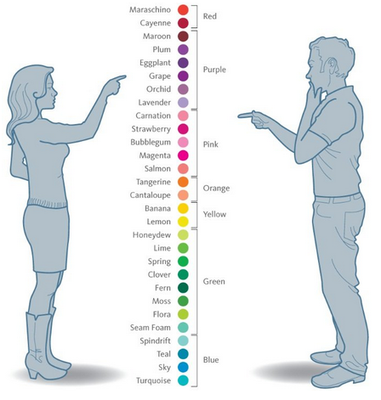
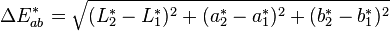
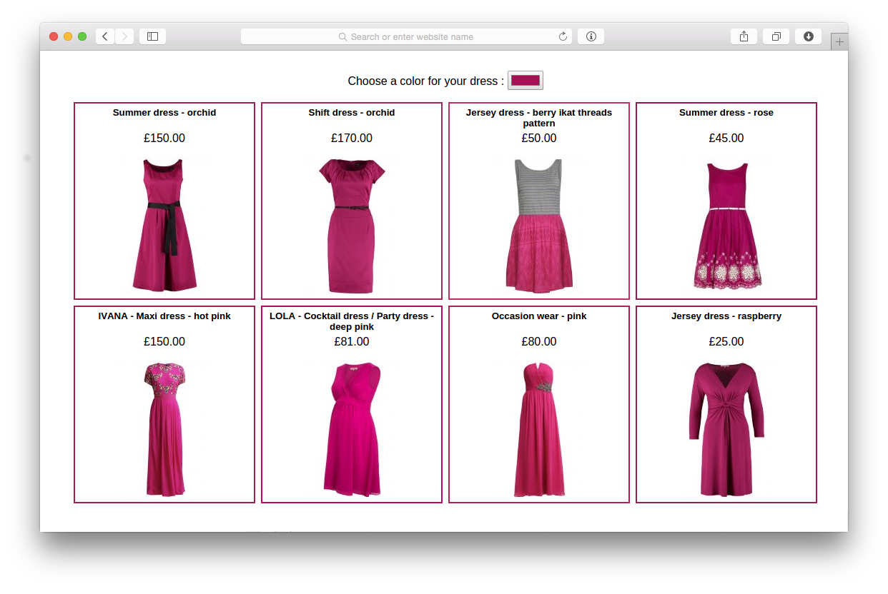

# Fifty Shades of Dress

This application allows the user to find articles on [Zalando API](https://api.zalando.com/) based on specific
input color. It was developed in couple of hours in [a hackathon](http://www.gruenderzentrum.rwth-aachen.de/2015/03/16/hackathon-spring-2015/)
and might be not a production ready implementation. It just aims to show how color based search functionality
can help the user to find the best match.

## Introduction



Color matters (especially to women). Most fashion eCommerce websites only allows to search on basic color groups but
if you are looking for a specific color, it is really hard to find it in thousands of listed products.

This application detects the dominant color of the product and store it in the NoSQL DB. It uses Lab color space because
it is the most convenient representation to get distance in terms of human perception. Once the server is received a request,
it changed the input to lab color space and returns closest 10 articles based on Euclidean distance of the color channels.



## WEB API

```
get /categories/                    list all available categories
get /categories/:category/:color    search for a specific color represented as /r,g,b in given category
```

## The iPhone App


## Web demo


(Here you may check the running demo.)[http://5.101.97.25:3000/]

## Running the project

Getting ready and running the server:

```bash
# canvas package has following dependencies
sudo apt-get install libcairo2-dev libjpeg8-dev libpango1.0-dev libgif-dev build-essential g++

# install node packages
npm install

# you can restore data:
mongorestore --drop -d zalando -c articles data/articles.bson
# or run the service to fill the database
$ node service.js

# now we are ready to run the app
$ node server.js
```

## Licence

(WTFPL)[http://www.wtfpl.net/txt/copying/]